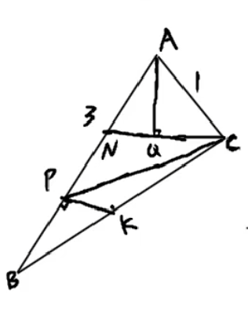

已知 $\triangle ABC$ 中，$AB=3$, $AC=1$, 且 $\left|\lambda\overrightarrow{AB}+3(1-\lambda)\overrightarrow{AC}\right|$ 的最小值为 $\dfrac{3\sqrt{3}}{2}$，若 $P$ 为边 $AB$ 上任意一点，则 $\overrightarrow{PB}\cdot\overrightarrow{PC}$ 的最小值为 \_\_\_\_\_\_

参考解答

<strong>解析</strong>

令 $\overrightarrow{AM}=\lambda\overrightarrow{AB}+3(1-\lambda)\overrightarrow{AC}$，则 $\overrightarrow{AM}=3\lambda\cdot\dfrac{1}{3}\overrightarrow{AB}+3(1-\lambda)\overrightarrow{AC}$

令 $\dfrac{1}{3}\overrightarrow{AB}=\overrightarrow{AN}$，则 $\overrightarrow{AM}=3\lambda\overrightarrow{AN}+3(1-\lambda)\overrightarrow{AC}$

令 $\overrightarrow{AQ}=\dfrac{1}{3}\overrightarrow{AM}=\lambda\overrightarrow{AN}+(1-\lambda)\overrightarrow{AC}$，则 $Q,N,C$ 共线

由 $|\overrightarrow{AM}|_{\min}=\dfrac{3\sqrt{3}}{2}$，得 $|\overrightarrow{AQ}|_{\min}=\dfrac{\sqrt{3}}{2}$

∴ $|CN|=1$，∴ $\angle BAC=\dfrac{\pi}{3}$

由余弦定理：$BC^2=9+1-2\times3\times1\times\dfrac{1}{2}=7$

由极化恒等式：$\overrightarrow{PB}\cdot\overrightarrow{PC}=PK^2-\dfrac{1}{4}BC^2=PK^2-\dfrac{7}{4}$

其中 $K$ 为 $BC$ 中点，$PK$ 的最小值为 $P$ 到 $BC$ 的距离：$|PK|_{\min}=\dfrac{\sqrt{7}}{2}\cdot\dfrac{\sqrt{3}}{2\sqrt{7}}=\dfrac{\sqrt{3}}{4}$

∴ $\overrightarrow{PB}\cdot\overrightarrow{PC}_{\min}=\dfrac{3}{16}-\dfrac{7}{4}=-\dfrac{25}{16}$

<strong>答案：</strong>$\displaystyle -\dfrac{25}{16}$

